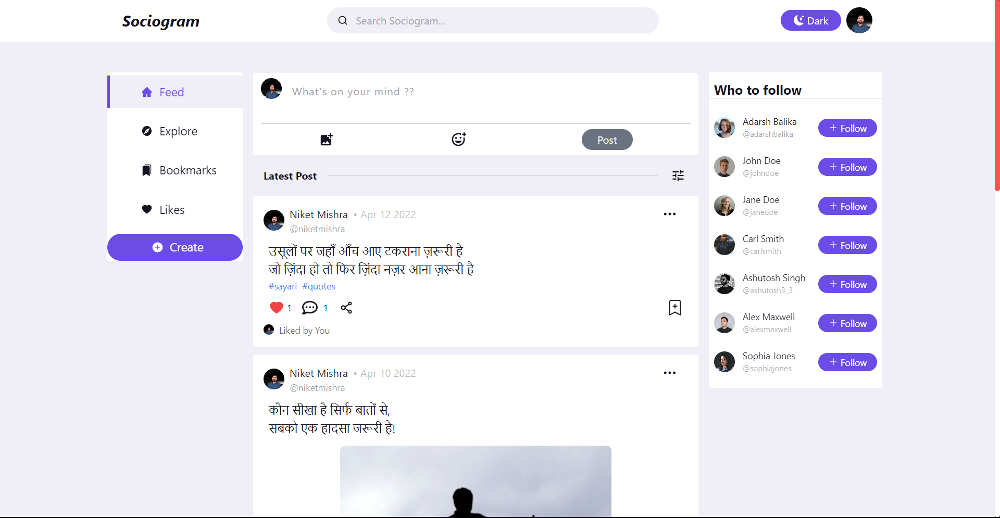
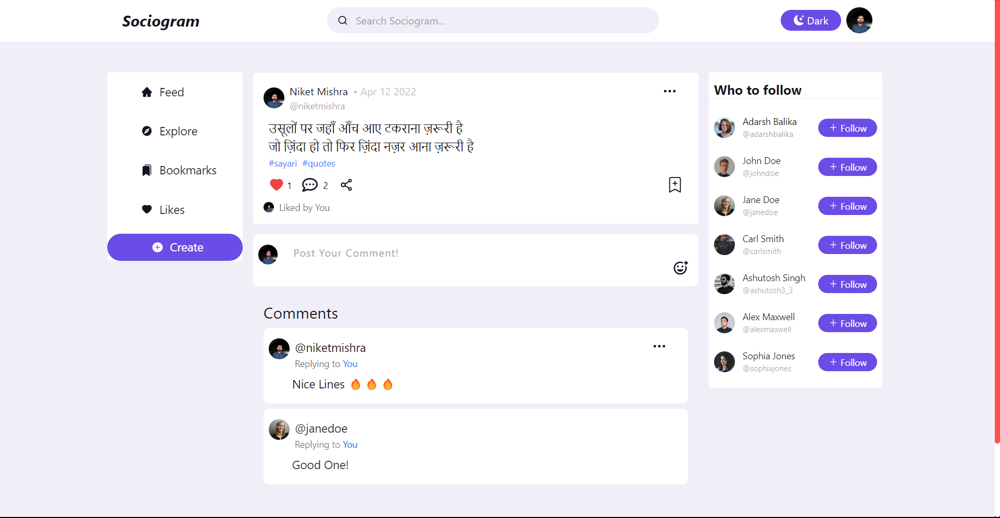

<div align="center">
  <br/>
  
  <h1>Sociogram</h1>
  <p>
    Sociogram is a Social Media App where you can share posts, ideas, learnings and many more...
  </p>
 </div>

## Live Link

[Sociogram](https://sociogramapp.netlify.app/)

## How to run the app locally?

```
$ git clone https://github.com/niketvns/sociogram
$ cd sociogram
$ npm install
$ npm start
```

## Screens in this project

- Authentication (Login, Signup) Pages
- User Feed Page
- Explore Page
- Liked Posts Page
- Bookmarks Page
- Post Details Page
- Profile Page
- 404 (Not Found) Page

## Features

- Authentication using JWT along with form validation for Login and Signup Pages. All the below features are present
  after login.
- User can create, edit and delete the post.
- Image and Emojis can be added to the Post.
- User can add, edit and delete comment on any post.
- User can like or unlike any post.
- User can add or remove post from bookmarks.
- Home Page where user can see their posts and the posts of friends followed by user.
- Trending, Latest and Oldest Feature where user can sort the posts based on maximum likes and by date.
- Explore Page where all the posts from all users on sociogram will be visible.
- Liked Page where all the posts liked by user will be visible.
- Bookmarks Page where all the posts bookmarked by user will be visible.
- User can follow or unfollow other users.
- Profile Page where user can edit their profile. It contains details like Account Creation Date, Avatar, Bio and
  Portfolio URL. User can edit the profile.
- User can view the profile of other users as well.
- Search Functionality with search suggestions.
- Suggestions with Follow Button on all pages.
- User can view all the comments of the post on the Individual Post Page.
- User can share the link of post with others.
- Loader is shown while the posts are fetched.
- Alerts in the app to notify the users about success/failure operations.
- Toggle between Light and Dark Themes.
- All the screens are Responsive.

## Tech Stack and Tools

- React + Context Api
- React Router v6
- Tailwind CSS
- Chakra UI
- Git For Version Control
- Netlify for Deployment
- Cloudinary for Image and Video Storage

## Live Link

[Sociogram](https://sociogramapp.netlify.app/)

[//]: # (## Demo Video)

## Screenshot

### User Feed Page



### User Profile Page


### Post Details Page



### Authentication Page

